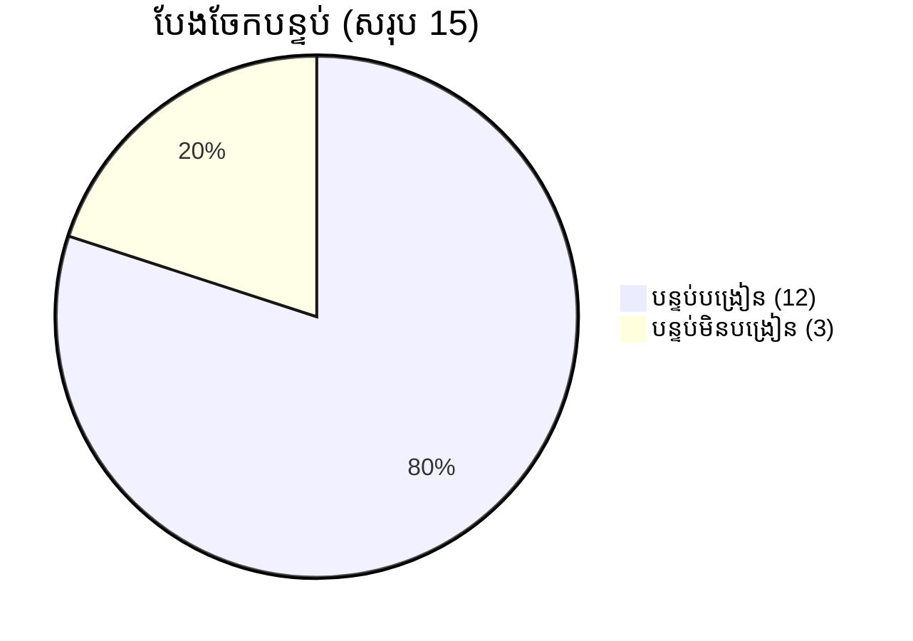
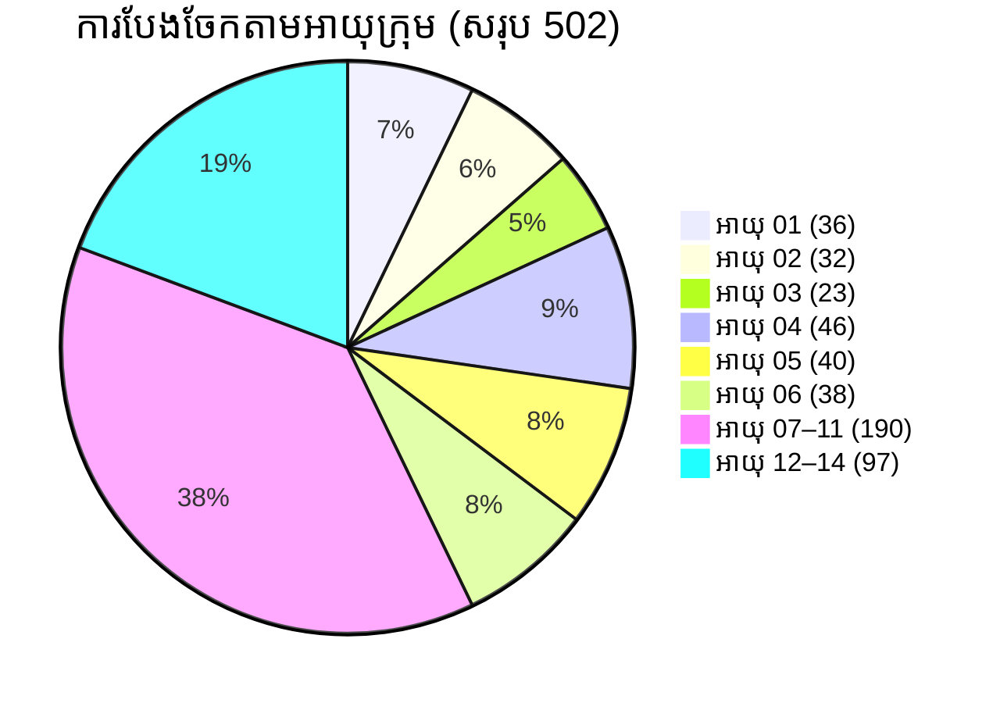
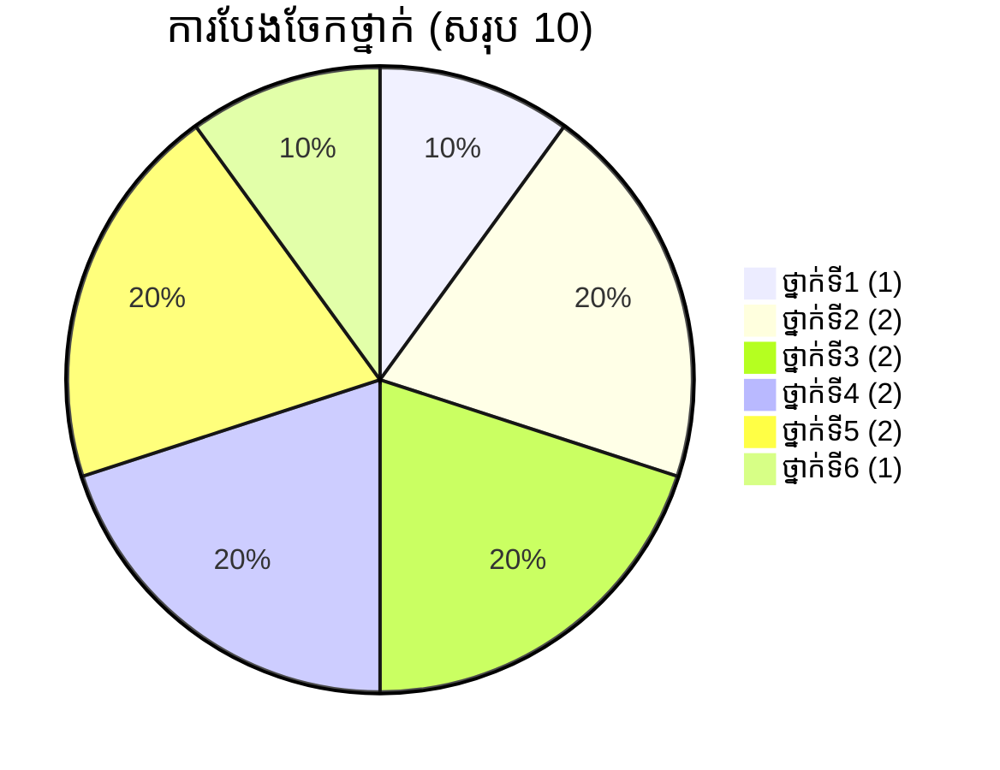
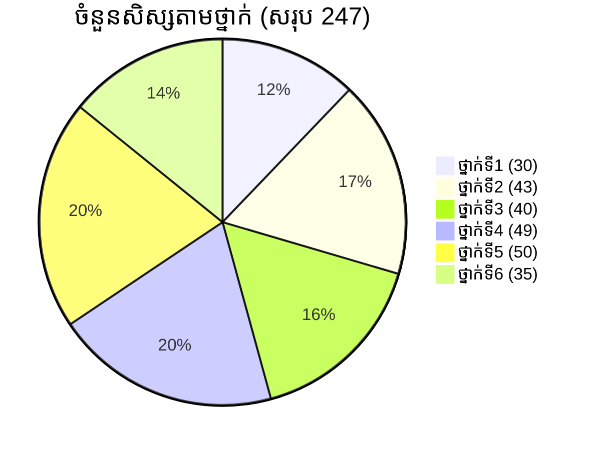
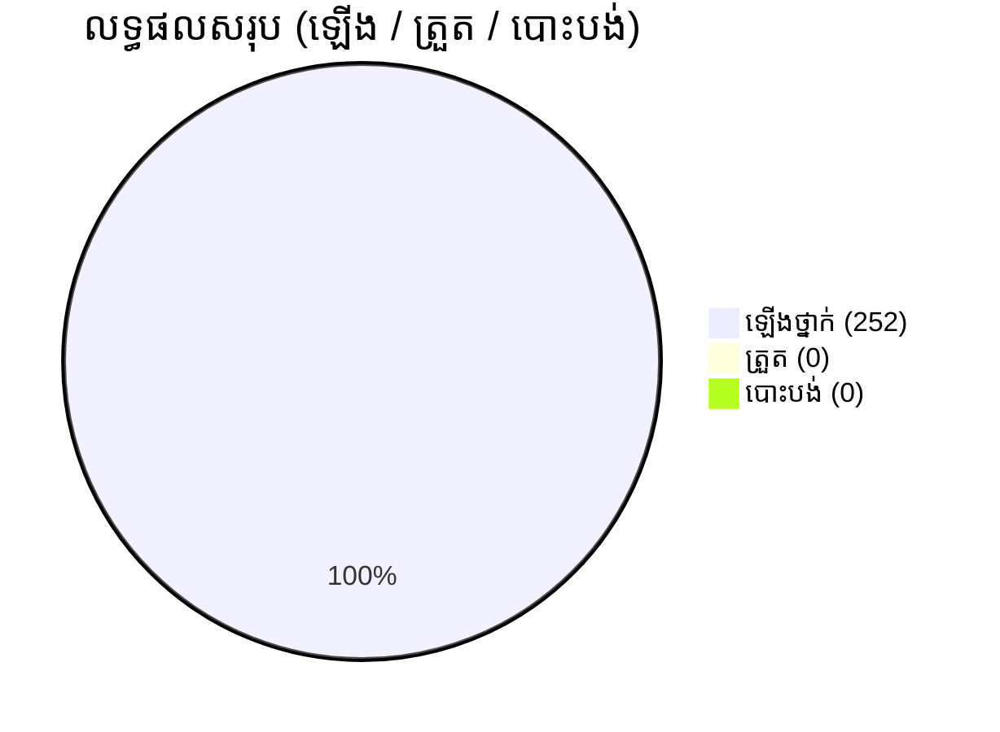
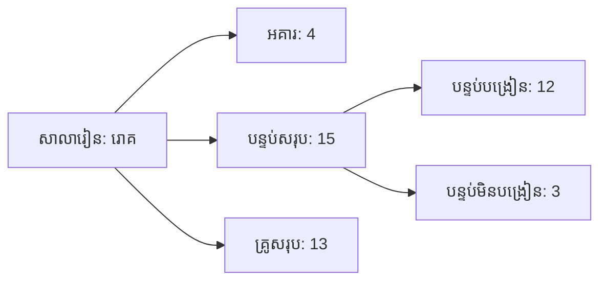
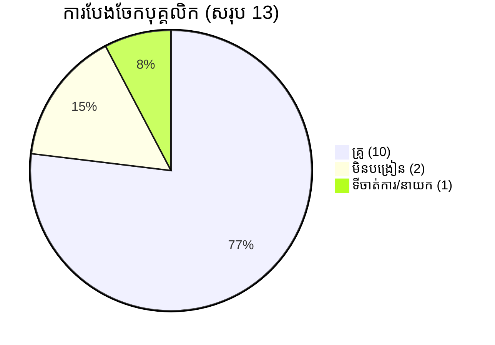
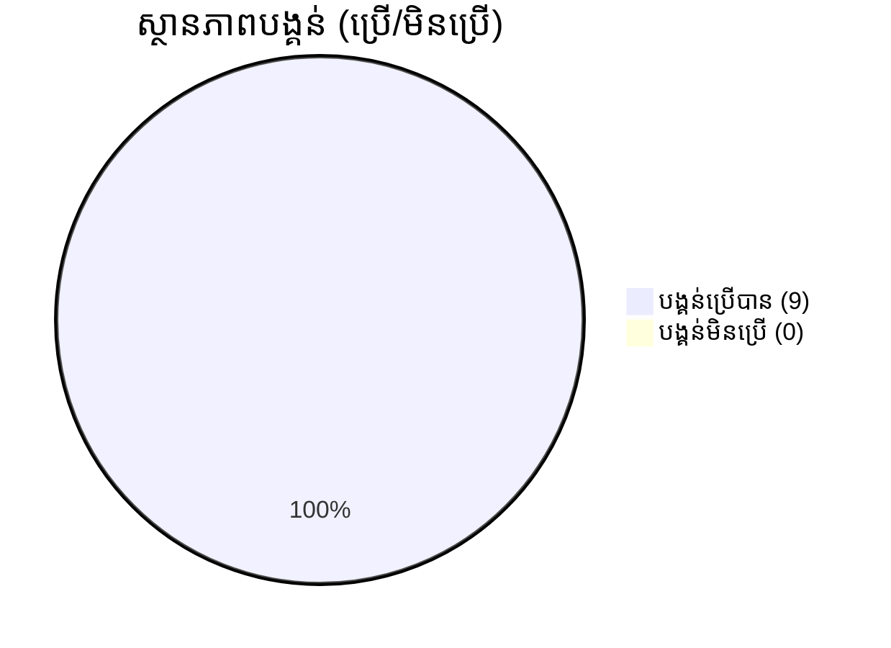

# របាយការណ៍ស្ថិតិសាលារៀន (ពេញលេញ និងរៀបចំបែបស្អាត)

**សាលារៀន**: រោគ  
**ភូមិ / ឃុំ**: ស្ពានស្រែង  
**នាយក**: សុខ សារើន (ស្រី) — ទូរស័ព្ទ: 089 66 39 66  
**កាលបរិច្ឆេទរាយការណ៍**: 2026-01-04

---

## មាតិកា
1. ស្ថានភាពសាលារៀង (I)  
2. ស្ថិតិកុមារអាយុ 01–14 (II)  
3. ស្ថិតិថ្នាក់ (III)  
4. ស្ថិតិសិស្សដើមឆ្នាំសិក្សា (IV)  
5. តេស្តដើមឆ្នាំ និង អត្រា (ឡើង/ត្រួត/បោះបង់)  
6. តារាងអគារ / បន្ទប់ / សិស្ស  
7. បុគ្គលិក និង តួនាទី  
8. កុមារអាយុ 01–06 នៅក្នុង/ក្រៅសាលា  
9. ព័ត៌មានចូលរៀនថ្នាក់ទី១  
10. កុមារអាយុ 06–14 ក្នុង/ក្រៅសាលា  
11. បន្ទប់/ថ្នាក់/គ្រូ  
12. ថ្នាក់គួប/កម្រិតថ្នាក់  
13. សេវា/វេនរៀន  
14. បណ្ណាល័យ និង អង្គការឧបត្ថម្ភ  
15. បង្គន់ និង ទឹកស្អាត  
16. កីឡា/សិល្បៈ/កសិកម្ម  
17. ការគាំទ្រកុមារី  
18. ករណីសិស្សក្រីក្រ និង សិស្សពិការ  
19. អាហារូបករណ៍ និង សំណើ  
20. ការងារសហគមន៍ និង ទិន្នន័យអនុគមន៍ផ្សេងៗ  
21. សង្ខេបសេចក្តីសម្រេច និង ផ្លូវនាំទៅមុខ

---

## សេចក្តីផ្តើម
ឯកសារនេះបង្រួមទិន្នន័យសរុបពី I → XXIV ដែលផ្តល់ដោយលោក/លោកស្រី។ ខ្ញុំបានធ្វើការ validate មូលដ្ឋាន (សរុប និង ភេទ) និងរៀបចំជា Markdown ដោយមានតារាង និង Mermaid diagrams សម្រាប់ visualization។ ប្រសិនបើចង់ Export ជា PDF / Excel / CSV សូមមើលផ្នែក Export Options ខាងក្រោម។

---

## 1. ស្ថានភាពសាលារៀន (I)
- ចំនួនកម្រងសាលារៀន: 01 កម្រង (ទាំងអស់ 0 សម្រាប់ប្រភេទផ្សេងៗ)  
- សាលាបិទទ្វារ: 0  
- សាលា (សរុប): 01 (គ្រប់កម្រិត: 01)  
- បន្ទប់សរុប: 15 (បន្ទប់បង្រៀន: 12, មិនបង្រៀន: 3)



---

## 2. ស្ថិតិកុមារអាយុ 01–14 (II)

សរុប​អាយុ 1–14: **502 នាក់** (ស្រី **245**, ប្រុស **257**)

| អាយុ / ក្រុម | សរុប | ស្រី | ប្រុស |
|---:|---:|---:|---:|
| 01 | 36 | 19 | 17 |
| 02 | 32 | 22 | 10 |
| 03 | 23 | 12 | 11 |
| 04 | 46 | 21 | 25 |
| 05 | 40 | 18 | 22 |
| 06 | 38 | 21 | 17 |
| 07–11 | 190 | 95 | 95 |
| 12–14 | 97 | 37 | 60 |
| **សរុប** | **502** | **245** | **257** |



---

## 3. ស្ថិតិថ្នាក់ (III)
- ចំនួនថ្នាក់សរុប: **10 ថ្នាក់** (មិនរាប់ថ្នាក់គួប)

| ថ្នាក់ | ចំនួនថ្នាក់ |
|---:|---:|
| ថ្នាក់ទី1 | 1 |
| ថ្នាក់ទី2 | 2 |
| ថ្នាក់ទី3 | 2 |
| ថ្នាក់ទី4 | 2 |
| ថ្នាក់ទី5 | 2 |
| ថ្នាក់ទី6 | 1 |
| ថ្នាក់គួប | 0 |
| **សរុប** | **10** |



---

## 4. ស្ថិតិសិស្សដើមឆ្នាំសិក្សា (IV)
- សរុប: **247 នាក់** (ស្រី **121**)

| ថ្នាក់ | សរុប | ស្រី | ប្រុស |
|---:|---:|---:|---:|
| ថ្នាក់ទី1 | 30 | 14 | 16 |
| ថ្នាក់ទី2 | 43 | 22 | 21 |
| ថ្នាក់ទី3 | 40 | 22 | 18 |
| ថ្នាក់ទី4 | 49 | 23 | 26 |
| ថ្នាក់ទី5 | 50 | 23 | 27 |
| ថ្នាក់ទី6 | 35 | 17 | 18 |
| **សរុប** | **247** | **121** | **126** |



---

## 5. តេស្តដើមឆ្នាំ និង អត្រា (ឡើង/ត្រួត/បោះបង់)
- តេស្តដើមឆ្នាំ: ទិន្នន័យសម្រាប់តេស្ត = **0** (គ្មានទិន្នន័យ) → % គណនា N/A  
- លទ្ធផលឡើងថ្នាក់ (ដើមឆ្នាំចាស់ → ឆ្នាំថ្មី): សរុប **252** (ស្រី **124**) បានឡើងថ្នាក់; ត្រួត = 0; បោះបង់ = 0



---

## 6. តារាងអគារ / បន្ទប់ / សិស្ស (សាលា: រោគ)
- អគារ: 4  
- បន្ទប់សរុប: 15 (បន្ទប់បង្រៀន 12, មិនបង្រៀន 3)  
- សិស្សសរុប: 247 (ស្រី 121)



---

## 7. បុគ្គលិក និង តួនាទី
- បុគ្គលិកសរុប: **13** (ស្រី **10**)  
  - នាយក: 1 (ស្រី)  
  - នាយករង: 0  
  - គ្រូ (បង្រៀន): 10 (ស្រី 9)  
  - មិនបង្រៀន: 2 (ស្រី 1)  
  - ជួយបង្រៀន: 2 (ស្រី 2)



- មុខងារពិសេស: បណ្ណារក្ស = 2, កសិកម្ម = 1

---

## 8. កុមារអាយុ 01–06 (ក្នុង និងក្រៅសាលា)
| អាយុ | សរុប | ស្រី |
|---:|---:|---:|
| 01 | 35 | 17 |
| 02 | 36 | 22 |
| 03 | 38 | 20 |
| 04 | 29 | 19 |
| 05 | 47 | 22 |
| 06 | 35 | 18 |
| បានចូលរៀន (age 6) | 29 | 14 |

---

## 9. ព័ត៌មានចូលរៀនថ្នាក់ទី១
- អាយុ 6 ក្នុងភូមិ: 38 (ស្រី 21)  
- ចូលរៀនថ្មីថ្នាក់ទី1: 30 (ស្រី 14)  
- អត្រា: 30 / 38 = **78.9%** (ស្រី: 14 / 21 = **66.7%**)

---

## 10. កុមារអាយុ 06–14 (ក្នុង និងក្រៅសាលា)
- 06–11: 228 (ស្រី 116) — បានចូលរៀន: 240 (ស្រី 119)  
- 12–14: 97 (ស្រី 37) — បានចូលរៀនបឋម/មធ្យម: មានករណីតិច  
- សរុប 06–14 (ទាំងអស់): 325 (ស្រី 153)  
- ក្នុងថ្នាក់ 1–6 បានចូលរៀន (primary): 247 (ស្រី 121)

---

## 11. បន្ទប់ / ថ្នាក់ / គ្រូ (ថ្នាក់ទាំងមូល)
- បន្ទប់ឆ្នាំចាស់ → ឆ្នាំថ្មី: 10 → 10 (កើន/ថយ = 0)  
- សរុបថ្នាក់ (1–6) = 10, សរុបគ្រូ = 10 (ស្រី 9)

---

## 12. ថ្នាក់គួប និង គ្រូបង្រៀនថ្នាក់គួប
- ថ្នាក់គួប: 0 (គ្មាន) — គ្រូបង្រៀនថ្នាក់គួប: 0

---

## 13. កម្រិតថ្នាក់
- មាន 6 កម្រិតសរុប

---

## 14. សេវា/វេនរៀន
- សាលា មាន 1 វេន (one shift)

---

## 15. បណ្ណាល័យ និង អង្គការឧបត្ថម្ភ
- បណ្ណាល័យ: មាន 1 (មានបន្ទប់)  
- អង្គការឧបត្ថម្ភ: World Vision  
- ចំនួនសិស្សសម្រង់បណ្ណាល័យ: 247 (ស្រី 121)

---

## 16. បង្គន់ និង ទឹកស្អាត
- ចំនួនបង្គន់: 9 (បានប្រើ: 9 → 100%)  
- អាងទឹក/ធុងចម្រោះ/សេវាទឹកស្អាត: ស្ថានភាព OK



---

## 17. កីឡា / សិល្បៈ / កសិកម្ម
- កសិកម្ម: មាន 1 (គ្រូកសិកម្ម 1)  
- កីឡា/សិល្បៈ/រោងជាង: មិនមានព័ត៌មានលម្អិតក្នុង raw — អាចបន្ថែមបាន

---

## 18. ការអនុវត្តកម្មវិធីទីប្រឹក្សាកុមារី
- មិនមានករណីរាយ (N/A)

---

## 19. សិស្សក្រីក្រ និង សិស្សពិការ
- សិស្សក្រីក្រ (ប៉ុន្មានករណី ក្នុង raw): សរុប 34 (ស្រី 9)  
- សិស្សពិការ: គ្មានករណីរាយក្នុង raw

---

## 20. សិស្សស្នើសុំអាហារូបករណ៍ (ថ្នាក់ 1–6)
| ថ្នាក់ | ចំនូនស្នើ | ស្រី | ទទួលបាន | % |
|---:|---:|---:|---:|---:|
| ថ្នាក់1 | 12 | 4 | 12 | 100% |
| ថ្នាក់2 | 21 | 10 | 21 | 100% |
| ថ្នាក់3 | 12 | 4 | 12 | 100% |
| ថ្នាក់4 | 25 | 13 | 25 | 100% |
| ថ្នាក់5 | 25 | 8 | 25 | 100% |
| ថ្នាក់6 | 16 | 7 | 16 | 100% |
| **សរុប** | **111** | **46** | **111** | **100%** |

---

## 21. ការងារសហគមន៍ និង អង្គការទ្រទ្រង់
- ការចូលរួមសហគមន៍: មាន 4 ដង ក្នុង 1 ឆ្នាំសិក្សា (openings / closings / events)  
- អង្គការឧបត្ថម្ភ: World Vision (1 សាលា, គ្រប់ 247 សិស្ស)

---

## សេចក្តីសង្ខេប និង ផ្លូវទៅមុខ
- ចំនួនសិស្សដើមឆ្នាំ = 247; ចំនួនកុមារ 01–14 = 502 (ស្រី 245, ប្រុស 257)  
- ករណីដែលត្រូវពិនិត្យ: អត្រាចូលរៀនថ្នាក់ទី1 (78.9%) និងអត្រាចូលរៀនសរុប/ពិនិត្យទិន្នន័យដែលមិនសម្រេចច្បាស់ (ឧ. បន្ទះលេខបន្ថែមក្នុង raw)  
- សំណូមពរ៖ សុំឧបត្ថម្ភបន្ទប់សិក្សា, ទឹកប្រើប្រាស់, វគ្គបណ្តុះបណ្តាលឌីជីថល, និងឧបករណ៍ ICT

---

## Export Options និង វិធីបម្លែង Markdown → PDF / PNG / XLSX / CSV / JSON

1. Preview Markdown
   - Visual Studio Code: បើក file → Ctrl+Shift+V (Open Preview)  
   - Typora / Obsidian: បើក និង preview ភ្លាមៗ  
   - GitHub: push file ទៅ repo → GitHub នឹង render automatically

2. Export Mermaid diagrams → PNG/SVG
   - Install mermaid-cli (Node.js):
     ```
     npm install -g @mermaid-js/mermaid-cli
     ```
     រួច run:
     ```
     mmdc -i diagram.mmd -o diagram.png
     ```
   - ឬប្រើ Mermaid Live Editor: https://mermaid.live

3. Markdown → PDF (Khmer-friendly)
   - ដើម្បី support Khmer fonts use XeLaTeX via pandoc:
     - ជំហានដំឡើង: pandoc (https://pandoc.org) និង TeX Live / MikTeX
     - ដំឡើង font Khmer (e.g., Khmer OS Siemreap / KhmerOS.ttf) នៅលើម៉ាស៊ីន
     - Command:
       ```
       pandoc របាយការណ៍_ស្ថិតិសាលារៀន_ពេញលេញ.md -o report.pdf --pdf-engine=xelatex -V mainfont="Khmer OS Siemreap"
       ```
     - ប្រសិន font ឈ្មោះខុស សូមដាក់ឈ្មោះ font ដែលបានដំឡើង។

4. Markdown → HTML → Print PDF
   - Convert to HTML:
     ```
     pandoc report.md -o report.html
     ```
     - Open report.html in browser → Print → Save as PDF

5. Generate CSV / XLSX / JSON / Charts automatically
   - ប្រើ script Python ដែលខ្ញុំបានផ្តល់ (generate_report.py) — វា produce:
     - outputs/ages.csv, grades.csv, staff.csv, data.json
     - report.xlsx
     - line_chart.png, pie_chart.png
     - report.pdf (simple PDF via ReportLab)
   - Run:
     ```
     pip install pandas matplotlib openpyxl reportlab
     python generate_report.py
     ```
   - ចំណាំ: ReportLab default font មិនតែង rendering Khmer; ប្រសិនចង់ embed Khmer អាច provide Khmer TTF ខ្ញុំនឹងបន្ថែម code register font។

6. Embed logo & signature in final PDF
   - ប្រសិនចង់ logo និង signature, ផ្តល់ images (PNG/JPG) ឬ URL — ខ្ញុំនឹងបន្ថែមលើ PDF template និង generate final PDF។

---

បើចង់, ខ្ញុំនឹង:
- 1) ផ្តល់ឯកសារ Markdown ពេញលេញ (.md) លើចុងនេះ (Done — file ដែលអ្នកទាមទារ)  
- 2) ផ្តល់ script កែខ្មែររួចដើម្បី embed Khmer TTF និង generate PDF ដោយ Pdfrender ត្រឹមត្រូវ (បន្ថែម)  
- 3) ឬ generate និងផ្ញើឯកសារបុគ្គល (CSV / XLSX / PNG / PDF) តាមរយៈ ZIP — ប្រសិនបើអ្នកអាចទទួល file upload/download

តើអ្នកចង់ខ្ញុំ:
A) ផ្តល់ command/script ដើម្បី embed Khmer font និង generate PDF (pandoc + xelatex) — ខ្ញុំនឹងផ្ដល់ steps និងពាក្យបញ្ជា?  
B) រត់ script និងផ្ញើឯកសារ generated នៅទីនេះ (ប្រសិនបើ platform គាំទ្រ file attachments)?  
C) ឬបន្ថែម logo និង ហត្ថលេខា នៅលើ PDF ទាំងស្រុង?

សូមជ្រើសចម្លើយដែលចង់ — ខ្ញុំនឹងបន្តធ្វើការ។
## 


